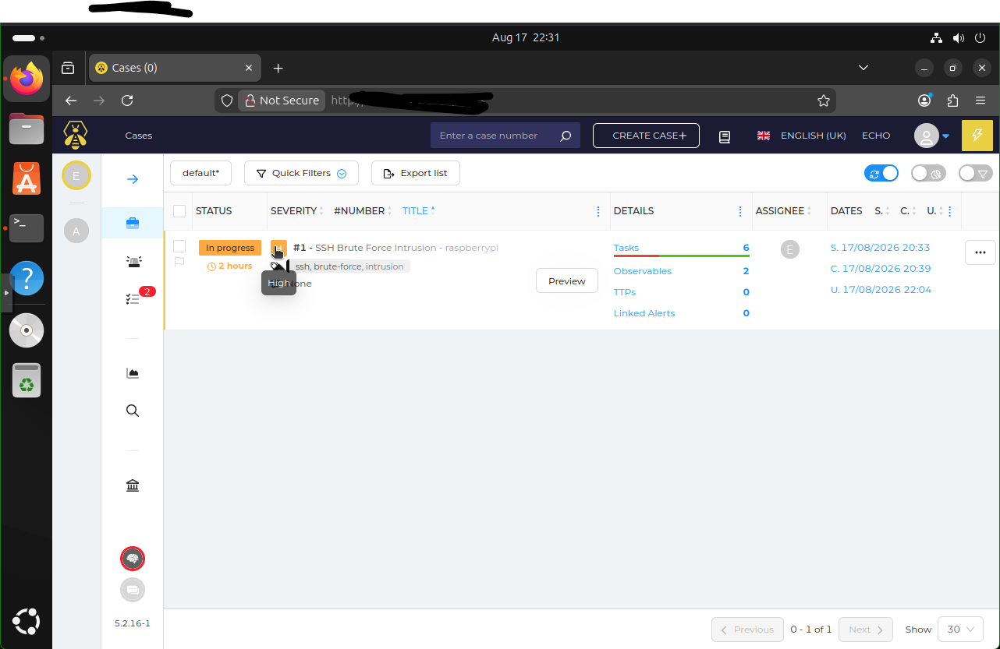
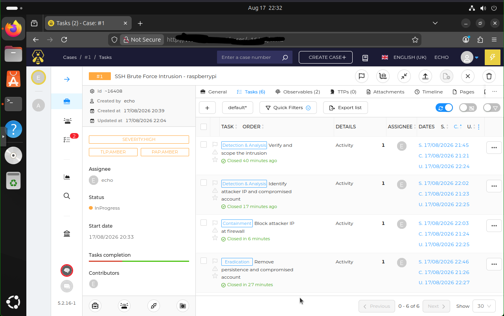
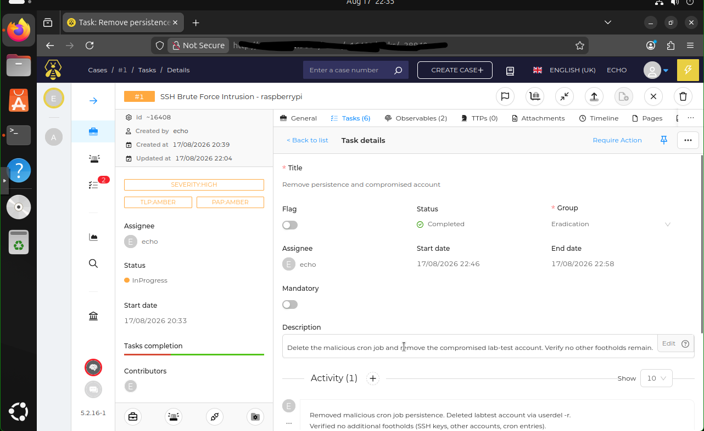
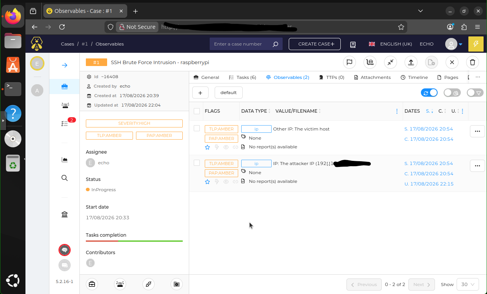
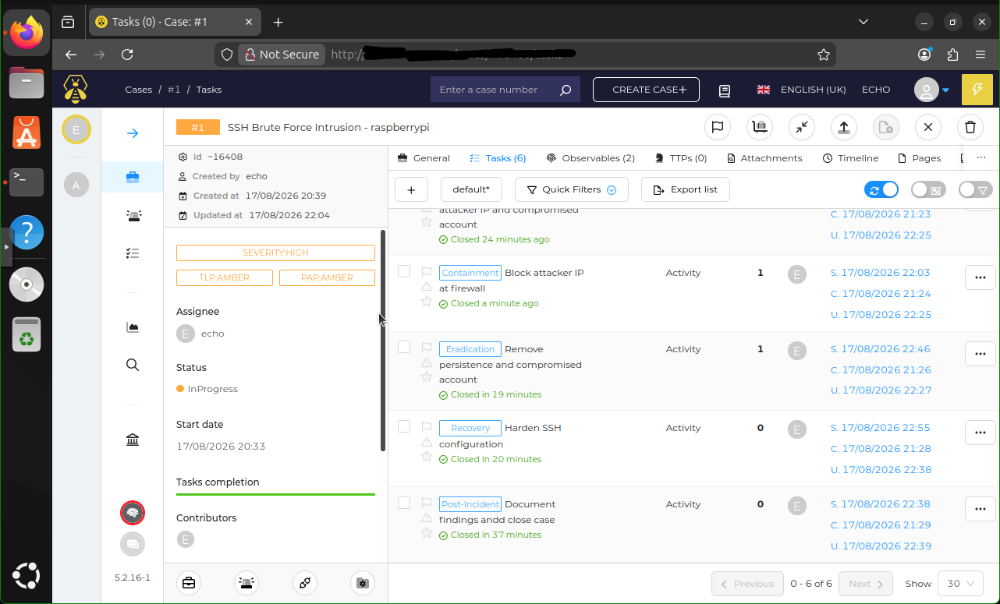
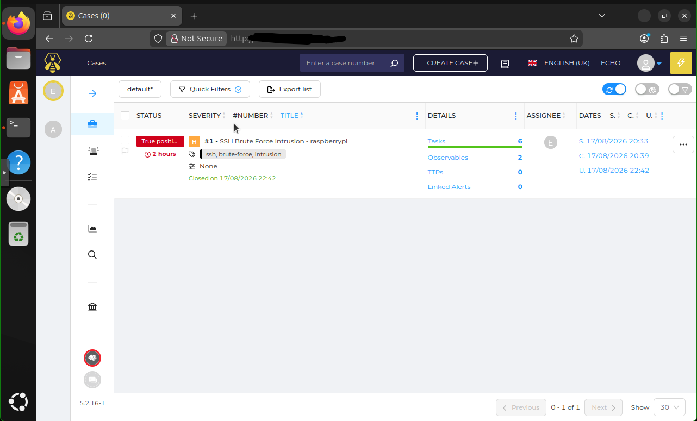

# 🗂️ SOC Case Management with TheHive


## Objective
Deploy TheHive, an open-source security incident response and case management platform, and manage a complete incident investigation through its full lifecycle. This project demonstrates how a Security Operations Center organizes, tracks, and documents investigations — taking a detected intrusion from case creation through structured investigation tasks, observable tracking, and formal resolution, mapped to the NIST 800-61 framework.

---

## Why Case Management Matters

Detection tools find threats and automation tools respond to them — but a SOC runs on **case management**. It's where investigations are organized, evidence is tracked, tasks are assigned and worked, analysts collaborate, and the full history of an incident is documented for review, audit, and handoff. TheHive is the leading open-source platform for this, and it completes the SOC workflow:

```
Splunk (detect)  →  Shuffle SOAR (automate/enrich)  →  TheHive (manage the case)  →  Resolve
```

This project adds the case management layer to a home SOC lab that already includes SIEM detection and SOAR automation.

---

## Architecture

TheHive is a multi-service platform deployed via Docker Compose:

```
┌─────────────────────────────────────────────┐
│  TheHive (case management web application)   │
│        ↓            ↓             ↓           │
│   Cassandra    Elasticsearch    MinIO        │
│   (data)       (indexing)    (file storage)  │
└─────────────────────────────────────────────┘
```

| Component | Role |
|-----------|------|
| TheHive | Case management application and web UI |
| Apache Cassandra | Primary data storage |
| Elasticsearch | Data indexing and search |
| MinIO | File and attachment storage |

---

## Environment

| Component | Details |
|-----------|---------|
| Platform | TheHive 5.2 (self-hosted via Docker Compose) |
| Host | Dedicated Ubuntu 24.04 VM on Proxmox |
| Hypervisor | Proxmox VE on HP EliteDesk |
| Containerization | Docker + Docker Compose v2 |
| Incident Source | SSH brute force intrusion (from IR project) |
| Framework | NIST SP 800-61 Rev. 2 |

---

## Deployment

TheHive was deployed as a containerized multi-service stack on a dedicated VM, keeping it isolated from the SIEM and SOAR platforms — mirroring enterprise architecture where case management runs on its own infrastructure.

Key deployment steps:
- Provisioned a dedicated Ubuntu VM (8GB RAM) to accommodate the memory-intensive stack
- Set `vm.max_map_count=262144` for Elasticsearch
- Defined all four services (TheHive, Cassandra, Elasticsearch, MinIO) in a single Docker Compose file with tuned memory limits for a resource-constrained lab
- Configured TheHive's connections to each backend via startup parameters

```bash
sudo sysctl -w vm.max_map_count=262144
docker compose up -d
```

---

## Case Management Workflow

The project demonstrates a full incident case lifecycle using a real intrusion scenario: a multi-stage SSH brute force attack that compromised a Linux endpoint.

### Case Overview
A High-severity case was created to track the SSH intrusion, with TLP marking, tags, and a full incident description.



### Investigation Tasks Structured by NIST Phase
Investigation tasks were organized into groups matching the NIST 800-61 lifecycle — Detection & Analysis, Containment, Eradication, Recovery, and Post-Incident — giving the case clear structure and demonstrating a methodical response.



### Task Documentation
Each task was worked and documented with task logs recording the specific investigative actions taken — the contemporaneous record that forms the backbone of a real investigation.



### Observable & IOC Tracking
Indicators of compromise (attacker IP, compromised host) were catalogued as observables, flagged as IOCs, and tied to the case as evidence.



### Case Progression
Tasks were worked and completed, moving the investigation through its phases to resolution.



### Case Closure
The case was closed with a structured resolution summary and a True Positive disposition — completing the full lifecycle.



---

## The Incident Managed

| Attribute | Detail |
|-----------|--------|
| Incident Type | Multi-stage SSH brute force intrusion |
| Affected Host | Linux endpoint (Raspberry Pi) |
| Compromised Account | labtest |
| Attack Chain | Recon → brute force → access → cron persistence |
| Severity | High |
| Resolution | True Positive – Resolved |
| Dwell Time | ~25 minutes |

---

## Case Lifecycle Demonstrated

```
1. CREATE     → open case with severity, TLP, description
2. STRUCTURE  → organize tasks by NIST 800-61 phase
3. INVESTIGATE→ work tasks, document actions in task logs
4. TRACK      → catalog observables/IOCs as evidence
5. RESOLVE    → close case with resolution summary
```

---

## Skills Demonstrated

- Deployment of a multi-service application stack via Docker Compose
- Security incident case management (TheHive)
- Structured investigation using the NIST 800-61 framework
- Observable and IOC tracking and documentation
- Contemporaneous investigation documentation (task logs)
- Full incident case lifecycle management
- SOC workflow integration (detection → automation → case management)
- Resource-constrained infrastructure planning

---

## Real-World Application

This mirrors how enterprise SOCs operate day to day. When an alert fires and requires investigation, analysts open a case, work it through structured tasks, track evidence as observables, collaborate, and document everything for audit and handoff. Case management is the organizational backbone that turns individual alerts into managed, documented, resolvable investigations — and TheHive is a platform used by real security teams to do exactly this.

---

## SOC Lab Project Series

This is part of a home SOC lab built to demonstrate end-to-end security operations:

| Project | Focus |
|---------|-------|
| SIEM Implementation & Log Analysis | Detection (Splunk) |
| Network Traffic Monitoring & Attack Detection | Packet analysis |
| Security Automation with Shuffle SOAR | Automation & enrichment |
| Incident Response (NIST 800-61) | IR process & execution |
| **SOC Case Management with TheHive** | **Case management** |

---

## References

- [TheHive Documentation](https://docs.strangebee.com/thehive/)
- [NIST SP 800-61 Rev. 2](https://csrc.nist.gov/publications/detail/sp/800-61/rev-2/final)
- [MITRE ATT&CK](https://attack.mitre.org)
